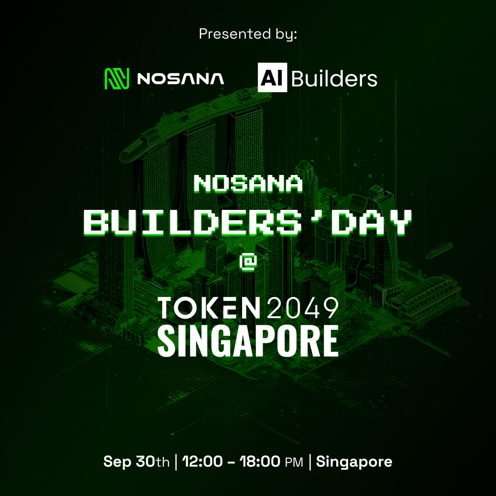

# Nosana and AI Builders Presents: BUIDL DAY @ TOKEN2049 🚀



## Welcome to the AI Agent Challenge

Build and deploy intelligent AI agents using the **Mastra framework** on the **Nosana decentralized compute network**. Whether you're a beginner or an experienced developer, this challenge has something for everyone!

## 🎯 Challenge Overview

Create an AI agent that can perform real-world tasks through tool calling capabilities. You'll build TypeScript functions that enable your agent to make API calls, perform calculations, fetch data, and interact with external services.

**Timeline**: 3 hours  
**Goal**: Build, containerize, and deploy a functional AI agent  
**Reward**: Prize pool for top 10 submissions  

## 🚀 Quick Start (2 minutes)

```bash
# 1. Fork and clone the repository
git clone https://github.com/nosana-ai/agent-challenge
cd agent-challenge

# 2. Install dependencies
npm install

# 3. Copy environment file
cp .env.example .env


# 4. Start development server
npm run dev
# Open http://localhost:8080 for the playground
```

## 🎯 Choose Your Path

We've prepared **3 prebuilt templates** to jumpstart your development. Pick the one that matches your skill level, or use them as inspiration to build something completely new!

### 🧮 Calculator Agent (Beginner)
**Perfect for**: First-time AI agent builders  
**What it does**: Performs mathematical operations and explains calculations step-by-step  
**Skills needed**: Basic TypeScript knowledge  
**Test prompts**:
- "Calculate 25 + 17"  
- "What's 100 divided by 4?"  
- "Multiply 12 by 8"  

### 💰 Crypto Price Agent (Intermediate)
**Perfect for**: Developers comfortable with APIs  
**What it does**: Fetches live cryptocurrency prices and market data  
**Skills needed**: API integration, JSON parsing  
**Test prompts**:
- "What's the current price of Bitcoin?"  
- "Show me SOL price"  
- "How much is Ethereum worth?"  

### 🐙 GitHub Stats Agent (Advanced)
**Perfect for**: Experienced developers  
**What it does**: Analyzes GitHub repositories and provides detailed statistics  
**Skills needed**: GitHub API, data processing  
**Test prompts**:
- "Get stats for facebook/react"  
- "Show me microsoft/typescript repository"  
- "Analyze nosana-ai/nosana-cli stats"  

## 🛠️ Build Your Own Agent

Want to create something unique? You can build your own agent from scratch! The `your-agent` template provides a starting foundation:

```bash
# Start with the basic template
# Edit src/mastra/agents/your-agent/your-tool.ts
# Edit src/mastra/agents/your-agent/your-agent.ts
npm run dev
```

**Ideas for custom agents**:
- Weather forecasting agent
- News summarization agent  
- Task management agent
- Social media analytics agent
- E-commerce price comparison agent

## 🏗️ Implementation Timeline

### Phase 1: Development (0:00 - 1:45)
1. **Setup** (0:00-0:15): Fork repo, install dependencies, choose template
2. **Build** (0:15-1:30): Implement your tool functions and agent logic
3. **Test** (1:30-1:45): Validate functionality at http://localhost:8080

### Phase 2: Containerization (1:45 - 2:00)
1. **Clean up**: Remove unused agents from `src/mastra/index.ts`
2. **Build**: Create Docker container
3. **Test locally**: Verify container works correctly

```bash
# Build your container
docker build -t yourusername/my-agent:0.0.0 .

# Test locally first
docker run -p 8080:8080 yourusername/my-agent:0.0.0

# Push to Docker Hub
docker login
docker push yourusername/my-agent:0.0.0
```

### Phase 3: Deployment (2:00 - 2:30)
1. **Deploy to Nosana**: Use the provided job definition
2. **Verify**: Ensure your agent runs on Nosana network
3. **Submit**: Provide deployment details

### Phase 4: Presentation (2:30 - 3:00)
Prepare your 2-minute pitch highlighting your agent's capabilities and innovation.

## 🔧 Technical Setup

### LLM Endpoint
Use the provided Nosana endpoint for your agents:

```bash
API_BASE_URL=https://4owyhaaufshxptwidyobx3eqvx2ef7henujzvvpqm93z.node.k8s.prd.nos.ci/api
MODEL_NAME_AT_ENDPOINT=qwen2.5:32b
```

### Local Development
```bash
npm run dev     # Start development server with playground
```

### Docker Commands
```bash
# Build and test locally
docker build -t yourusername/agent-challenge:0.0.0 .
docker run -p 8080:8080 yourusername/agent-challenge:0.0.0

# Push to registry
docker login
docker push yourusername/agent-challenge:0.0.0
```

## 🚀 Deploying to Nosana

### Prerequisites
- Register via the [Luma Page](https://luma.com/nosana-buidlday-SG) to receive credits
- Have a Docker Hub account with your pushed image

### Using Nosana Dashboard
1. Open [Nosana Dashboard](https://dashboard.nosana.com/deploy)
2. Click `Expand` to open the job definition editor
3. Edit `nos_job_def/nosana_mastra.json` with your Docker image:
   ```json
   {
     "image": "yourusername/agent-challenge:0.0.0"
   }
   ```
4. Copy and paste the edited job definition
5. Select a GPU
6. Click `Deploy`

### Using Nosana CLI (Alternative)
```bash
npm install -g @nosana/cli
nosana job post --file ./nos_job_def/nosana_mastra.json --market nvidia-3090 --timeout 30
```

## 🏆 Judging Criteria

Submissions evaluated on 4 key areas (25% each):

### 1. Innovation 🎨
- Originality of agent concept
- Creative use of AI capabilities
- Unique problem-solving approach

### 2. Technical Implementation 💻
- Code quality and organization
- Proper use of Mastra framework
- Efficient tool implementation
- Error handling and robustness

### 3. Nosana Integration ⚡
- Successful deployment on Nosana
- Resource efficiency
- Stability and performance
- Proper containerization

### 4. Real-World Impact 🌍
- Practical use cases
- Potential for adoption
- Clear value proposition
- Demonstration quality

## 🎁 Prizes

**Top 10 submissions will be rewarded:**
- 🥇 1st Place: $TBD USDC
- 🥈 2nd Place: $TBD USDC  
- 🥉 3rd Place: $TBD USDC
- 🏅 4th-10th Place: Prizes TBD

## 📚 Learning Resources

### Essential Reading
- [Mastra Agents Overview](https://mastra.ai/en/docs/agents/overview)
- [Build an AI Stock Agent Guide](https://mastra.ai/en/guides/guide/stock-agent)
- [Mastra Tool Calling Documentation](https://mastra.ai/en/docs/agents/tools)

### Documentation Links
- [Nosana Documentation](https://docs.nosana.io)
- [Mastra Documentation](https://mastra.ai/docs)
- [Docker Documentation](https://docs.docker.com)
- [Nosana CLI](https://github.com/nosana-ci/nosana-cli)

## 🆘 Support & Community

### Get Help
- **Discord**: Join [Nosana Discord](https://nosana.com/discord) 
- **Dedicated Channel**: [Builders Challenge Dev Chat](https://discord.com/channels/236263424676331521/1354391113028337664)
- **Twitter**: Follow [@nosana_ai](https://x.com/nosana_ai) for live updates


## 🎉 Ready to Build?

1. **Fork** this repository
2. **Choose** your template or go custom
3. **Build** your AI agent
4. **Deploy** to Nosana
5. **Present** your creation

Good luck, builders! We can't wait to see the innovative AI agents you create for the Nosana ecosystem.

**Happy Building!** 🚀

---

*This challenge is part of TOKEN2049 Singapore. For the latest updates and announcements, join our Discord and follow our social channels.*