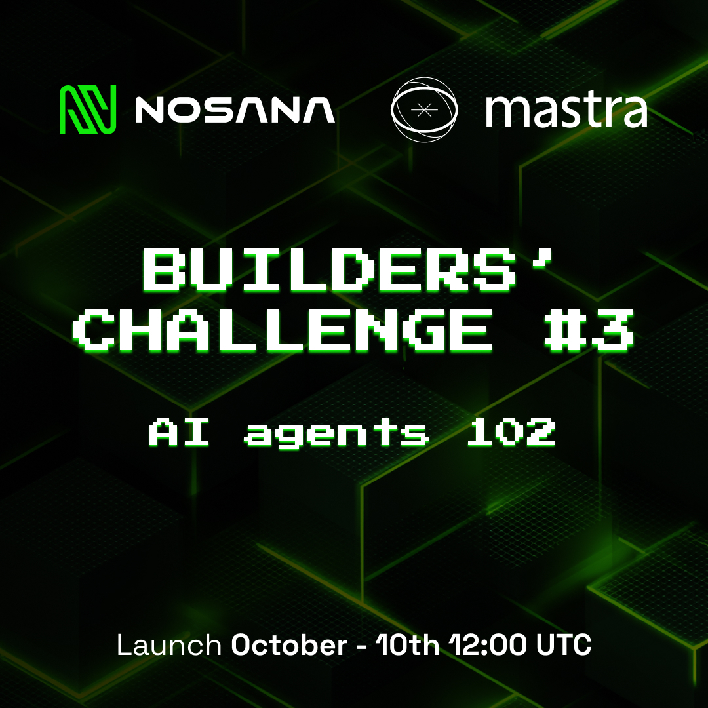

# Nosana and AI Builders Presents: BUIDL DAY @ TOKEN2049 🚀



## Welcome to the AI Agent Challenge

Build and deploy intelligent AI agents using the **Mastra framework** on the **Nosana decentralized compute network**. Whether you're a beginner or an experienced developer, this challenge has something for everyone!

## 🎯 Challenge Overview

Create an AI agent that can perform real-world tasks through tool calling capabilities. You'll build TypeScript functions that enable your agent to make API calls, perform calculations, fetch data, and interact with external services.

## Getting Started Template

This is a starter template for building AI agents using [Mastra](https://mastra.ai) and [CopilotKit](https://copilotkit.ai). It provides a modern Next.js application with integrated AI capabilities and a beautiful UI.

## Prerequisites

- Node.js 18+ 
- Any of the following package managers:
  - pnpm (recommended)
  - npm
  - yarn
  - bun

> **Note:** This repository ignores lock files (package-lock.json, yarn.lock, pnpm-lock.yaml, bun.lockb) to avoid conflicts between different package managers. Each developer should generate their own lock file using their preferred package manager. After that, make sure to delete it from the .gitignore.

## Getting Started

0. **Fork** this repository to your own GitHub account, then clone it locally.

```bash
git clone https://github.com/nosana-ai/agent-challenge
cd agent-challenge

cp .env.example .env
```


1a. Use Local LLM (Optional)

Edit the `.env` file to use a local LLM endpoint

```env
# Qwen3:8b - LocalHost - Local Development
# Note baseURL for Ollama needs to be appended with `/api`
OLLAMA_API_URL=http://127.0.0.1:11434/api
MODEL_NAME_AT_ENDPOINT=qwen3:0.6b
```

Start Ollama server locally (make sure you have Ollama installed)
```sh
# https://ollama.com/download
ollama pull qwen3:0.6b
ollama serve
```

1b. Use Nosana LLM Endpoint (Recommended)

There is a dedicated LLM endpoint for the challenge hosted on Nosana. You ca use it for free during the challenge.
If it goes down, please reach out on [Discord](https://discord.com/channels/236263424676331521/1354391113028337664)

Otherwise you can deploy your own Qwen3:8b model on Nosana.

Edit the `.env` file to use the Nosana LLM endpoint
```env
# Qwen3:8b - Nosana Endpoint
# Note baseURL for Ollama needs to be appended with `/api`
OLLAMA_API_URL=https://<nosana-url-id>.node.k8s.prd.nos.ci/api
MODEL_NAME_AT_ENDPOINT=qwen3:8b


```

🚀 Deploying to Nosana

#### Prerequisites

To get Nosana credits and NOS tokens for deployment, you need to:

- Register at [SuperTeam](https://earn.superteam.fun/listing/nosana-builders-challenge-agents-102)
- Register at the [Luma Page](https://luma.com/zkob1iae)
- Star the following repos: 
  - [this repo](https://github.com/nosana-ci/agent-challenge)
  - [Nosana CLI](https://github.com/nosana-ci/nosana-cli)
  - [Nosana SDK](https://github.com/nosana-ci/nosana-sdk)
- Lastly register at [this form](https://e86f0b9c.sibforms.com/serve/MUIFALaEjtsXB60SDmm1_DHdt9TOSRCFHOZUSvwK0ANbZDeJH-sBZry2_0YTNi1OjPt_ZNiwr4gGC1DPTji2zdKGJos1QEyVGBzTq_oLalKkeHx3tq2tQtzghyIhYoF4_sFmej1YL1WtnFQyH0y1epowKmDFpDz_EdGKH2cYKTleuTu97viowkIIMqoDgMqTD0uBaZNGwjjsM07T)

#### Using Nosana Dashboard

1. Open [Nosana Dashboard](https://dashboard.nosana.com/deploy)
2. Click `Expand` to open the job definition editor
4. Copy and paste the job definition, `./nos_job_def/llm.json`
5. Select a GPU, e.g. `nvidia-3090` (The Vram is needs to be >= 24GB for Qwen3:8b)
6. Click `Deploy`

#### Using Nosana CLI (Alternative)

```bash
npm install -g @nosana/cli
nosana job post --file ./nos_job_def/nosana_mastra.json --market nvidia-3090 --timeout 30
```

1c. Add your OpenAI API key (Optional)

```bash
# OpenAI - Uncomment and add apikey to use OpenAI
# Uncomment the corresponding line in `src/mastra/agents/index.ts` to use OpenAI
# OPENAI_API_KEY=
```

2. Install dependencies using your preferred package manager:
```bash
# Using pnpm (recommended)
pnpm install

# Using npm
npm install

# Using yarn
yarn install

# Using bun
bun install
```

2. Start the development server (assuming pnpm):
```bash
pnpm run dev:ui ## Start the UI server
pnpm run dev:agent ## Start the Mastra server
```

This will start both the UI and agent servers concurrently.

Mastra server will run on port `4111` and the UI server on port `3000`.


## 🏗️ Implementation Timeline

### Phase 1: Development
1. **Setup** : Fork repo, install dependencies, choose template
2. **Build** : Implement your tool functions and agent logic
3. **Test** : Validate functionality at http://localhost:8080

### Phase 2: Containerization 
1. **Clean up**: Remove unused agents from `src/mastra/index.ts`
2. **Build**: Create Docker container
3. **Test locally**: Verify container works correctly

```bash
# Build your container
docker build -t yourusername/my-agent:0.0.0 .

# Test locally first
docker run -p 8080:8080 yourusername/my-agent:0.0.0

# Push to Docker Hub
docker login
docker push yourusername/my-agent:0.0.0
```

### Phase 3: Deployment
1. **Deploy to Nosana**: Use the provided job definition
2. **Verify**: Ensure your agent runs on Nosana network
3. **Submit**: Provide deployment details

### Phase 4. Video Demo

- Record a 1-3 minute video demonstrating:
  - Your agent running on Nosana
  - Key features and functionality
  - Real-world use case demonstration
- Upload to YouTube, Loom, or similar platform

### Phase 5. Documentation

- Update this README with:
  - Agent description and purpose
  - Setup instructions
  - Environment variables required
  - Docker build and run commands
  - Example usage

## Submission Process

1. **Complete all requirements** listed above
2. **Commit all of your changes to the `main` branch of your forked repository**
   - All your code changes
   - Updated README
   - Link to your Docker container
   - Link to your video demo
   - Nosana deployment proof
3. **Social Media Post**: Share your submission on X (Twitter), BlueSky, or LinkedIn
   - Tag @nosana_ai
   - Include a brief description of your agent
   - Add hashtag #NosanaAgentChallenge
4. **Star the following repos**
  - [this repo](https://github.com/nosana-ci/agent-challenge)
  - [Nosana CLI](https://github.com/nosana-ci/nosana-cli)
  - [Nosana SDK](https://github.com/nosana-ci/nosana-sdk)
5. **Finalize your submission on the <https://earn.superteam.fun/listing/nosana-builders-challenge-agents-102> page**

- Remember to add your forked GitHub repository link
- Remember to add a link to your X post.
- Submissions that do not meet all requirements will not be considered.


## 🚀 Deploying to Nosana


### Using Nosana Dashboard
1. Open [Nosana Dashboard](https://dashboard.nosana.com/deploy)
2. Click `Expand` to open the job definition editor
3. Edit `nos_job_def/nosana_mastra.json` with your Docker image:
   ```json
   {
     "image": "yourusername/agent-challenge:0.0.0"
   }
   ```
4. Copy and paste the edited job definition
5. Select a GPU
6. Click `Deploy`

### Using Nosana CLI (Alternative)
```bash
npm install -g @nosana/cli
nosana job post --file ./nos_job_def/nosana_mastra.json --market nvidia-3090 --timeout 30
```

## 🏆 Judging Criteria

Submissions evaluated on 4 key areas (25% each):

### 1. Innovation 🎨
- Originality of agent concept
- Creative use of AI capabilities
- Unique problem-solving approach

### 2. Technical Implementation 💻
- Code quality and organization
- Proper use of Mastra framework
- Efficient tool implementation
- Error handling and robustness

### 3. Nosana Integration ⚡
- Successful deployment on Nosana
- Resource efficiency
- Stability and performance
- Proper containerization

### 4. Real-World Impact 🌍
- Practical use cases
- Potential for adoption
- Clear value proposition
- Demonstration quality

## 🎁 Prizes

**Top 10 submissions will be rewarded:**
- 🥇 1st Place: $1.000 USDC
- 🥈 2nd Place: $750 USDC  
- 🥉 3rd Place: $450 USDC
- 🏅 4th Place: $200 USDC
- 🏅 5th-10th Place: Prizes $100 USDC each

## 📚 Learning Resources

For more information, check out the following resources:

- [Mastra Documentation](https://mastra.ai/en/docs) - Learn more about Mastra and its features
- [CopilotKit Documentation](https://docs.copilotkit.ai) - Explore CopilotKit's capabilities
- [Next.js Documentation](https://nextjs.org/docs) - Learn about Next.js features and API

### Essential Reading

- [Mastra Agents Overview](https://mastra.ai/en/docs/agents/overview)
- [Build an AI Stock Agent Guide](https://mastra.ai/en/guides/guide/stock-agent)
- [Mastra Tool Calling Documentation](https://mastra.ai/en/docs/agents/tools)

### Documentation Links
- [Nosana Documentation](https://docs.nosana.io)
- [Mastra Documentation](https://mastra.ai/docs)
- [Docker Documentation](https://docs.docker.com)
- [Nosana CLI](https://github.com/nosana-ci/nosana-cli)

## 🆘 Support & Community

### Get Help
- **Discord**: Join [Nosana Discord](https://nosana.com/discord) 
- **Dedicated Channel**: [Builders Challenge Dev Chat](https://discord.com/channels/236263424676331521/1354391113028337664)
- **Twitter**: Follow [@nosana_ai](https://x.com/nosana_ai) for live updates

## 🎉 Ready to Build?

1. **Fork** this repository
2. **Build** your AI agent
3. **Deploy** to Nosana
4. **Present** your creation

Good luck, builders! We can't wait to see the innovative AI agents you create for the Nosana ecosystem.

**Happy Building!** 🚀


